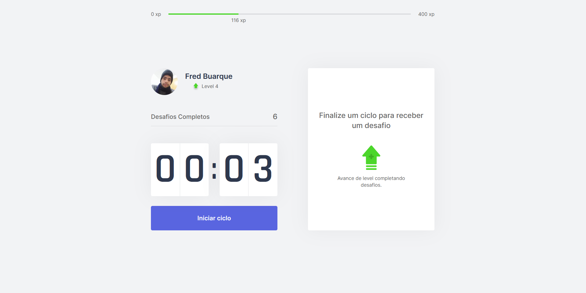
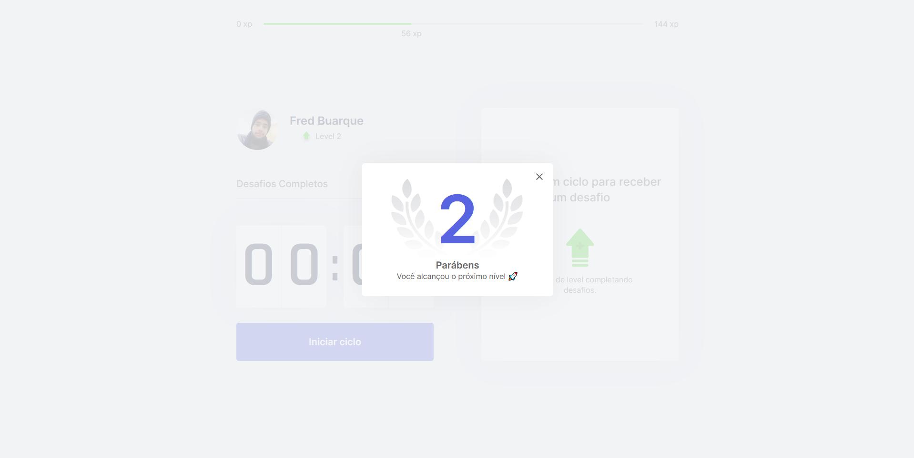

# moveit-next
## Move It é um projeto Front-End criado utilizando ReactJS, NextJS e TypeScript durante a NLW#4 da Rocketseat. 


📌 Conteúdo
=================
<!--ts-->
   * [Tecnologias](#Tecnologias)
      * [React](#React)
      * [Next](#Next)
      * [Typescript](#Typescript)
      * [js-cookie](#js-cookie)
<!--te-->

### Fotos
=================
<h1 align="center">
  
</h1>

<h1 align="center">
  
</h1>


### 🎲 Executando a Aplicação

```bash
# Clone este repositório
$ git clone https://github.com/frdbrq/moveit-next.git


# Instale as dependências
$ yarn

# Execute 
$ yarn dev

# O servidor inciará na porta:3000 - acesse <http://localhost:3000>

```


### Autor
---

<a href="https://github.com/frdbrq">
 
 <br />
 <sub><b>Fred Buarque</b></sub></a> <br>

### Projeto desenvolvido com carinho após acompanhar as aulas da NLW#04
